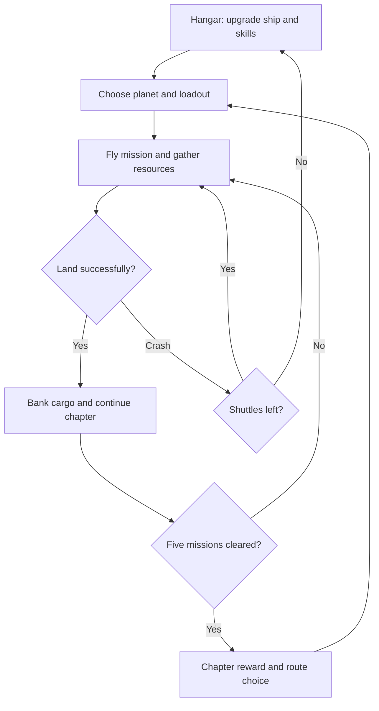

# Lunar Landing: Roguelite Expansion Roadmap

## Claude-ready game design and implementation brief

**Target:** Expand the existing Lunar Landing game from approximately 15 levels into a replayable, physics-driven roguelite with 10 celestial bodies, 5 missions per body, permanent progression, strategic loadouts, ship upgrades, environmental hazards, and light combat.

**Total authored campaign content:** 50 missions.

**Core rule:** The game must remain a landing game first. Combat, upgrades, hazards, and roguelite systems should deepen the landing decisions without replacing the satisfying thruster-based flight model that already works.

---

## 1. Product vision

The finished game should feel like a combination of:

- A precise lunar-lander physics game with readable, forgiving-but-demanding landing grades.
- A roguelite expedition in which failed runs still produce useful permanent progress.
- A route-planning game in which the next planet, loadout, and resource target matter.
- A ship-building game with a close-up, visually evolving lander in a hangar.
- A restrained action game in which weapons and defensive abilities solve specific threats but never overpower the flight mechanics.

### Design pillars

1. **Preserve the flight feel.** Do not rewrite the side thrusters, main thrust, inertia, or input response unless a measured problem is found. The current controls are a strength.
2. **Every celestial body changes how the player lands.** A new body must be more than a background, gravity value, or color swap.
3. **Terrain is a primary challenge.** Landing zones should sit inside craters, on ridges, between cliffs, on slopes, beside hazards, or on moving/unstable surfaces. Large flat floors should be rare.
4. **Failure creates progress, not a dead end.** A failed expedition returns the player to the hangar with enough retained resources to make a useful decision.
5. **Knowledge is a form of progression.** The player should learn wind, heat, ice, plumes, visibility, enemies, and route planning—not merely out-stat the game.
6. **Upgrades create options rather than automatic victory.** No permanent upgrade should eliminate an entire planet's mechanic.
7. **First visits teach; fifth missions test mastery.** Mission 1 of every body introduces its signature mechanic in a real challenge. It should not be a consequence-free tutorial.

---

## 2. Required progression structure

### Recommended resolution of the 5-level/10-level conflict

The requested content is five missions per body, but the route choice was described as happening after ten levels. The cleanest structure is:

- A **planetary chapter** contains 5 missions on one celestial body.
- After mission 5, the player chooses the next body from **4 randomly offered eligible bodies**.
- Every two completed bodies—10 total missions—the player reaches a **sector checkpoint** with a larger reward, full banking of materials, repair/restock, and a refreshed route pool.
- The Moon is the fixed opening body on a new save. After that, the route becomes player-directed.

This preserves 5 missions per body, gives the player meaningful strategic loadout choices at the correct time, and retains the requested 10-level milestone.

### Strict alternative if planet selection must occur only after every 10 levels

Generate four **two-body route cards** at each checkpoint. Each card previews a 10-mission route such as `Titan → Europa` or `Mercury → Mars`. The player chooses one card, completes five missions on each body, then returns to the four-card selection. This is preferable to inventing five filler levels on every body.

### Route eligibility

Do not offer all nine remaining bodies immediately. Use discovery tiers so difficulty and required counters remain fair:

- **Opening:** Moon is mandatory.
- **Tier A:** Mars, Titan, Europa, Enceladus.
- **Tier B:** Mercury, Venus, Io. Unlock after any two non-Moon chapters are cleared.
- **Tier C:** Pluto and Ganymede. Unlock after five total chapters are cleared.
- A completed body is removed from the main campaign pool, but later becomes available in an optional repeat/expert pool.
- If fewer than four eligible unfinished bodies remain, fill the selection with every remaining body rather than duplicates.

Each planet card must reveal:

- Gravity and atmosphere category.
- Main hazards.
- Enemy intensity.
- Likely rare material.
- Recommended active and passive modules.
- Estimated difficulty.
- A forecast that is helpful but not perfectly complete.

### Run, lives, and reset rules

- The player begins an expedition with **3 shuttles/landers**.
- A crash consumes one shuttle and restarts the current mission with the same deterministic layout seed, allowing the player to learn from the attempt.
- Losing all three shuttles ends the expedition and returns the player to the hangar.
- On expedition failure, progress within the current 10-mission sector resets. Earlier sector checkpoints remain cleared.
- Permanent ship upgrades, skill-tree nodes, discovered planets, unlocked module blueprints, and banked resources always persist.
- Successful completion of a five-mission planetary chapter restores one shuttle, up to the current maximum.
- A late upgrade may raise the expedition maximum from 3 to 4 shuttles, but this should be expensive and never available early.

This creates a meaningful death loop without forcing the player to replay all 50 missions after every failure.

---

## 3. Core gameplay loop



### Moment-to-moment mission loop

1. See the landing zone, initial telemetry, forecast, and optional objective.
2. Plan a descent route around terrain, weather, heat, plumes, enemies, or visibility loss.
3. Use main thrust and side thrusters to manage momentum.
4. Choose whether to divert for resources, destroy threats, or take the safest path.
5. Commit to the final approach.
6. Receive a clear landing grade with exact reasons.
7. Bank rewards, repair limited damage, and continue—or lose a shuttle and retry.

### Optional mission objectives

Use one optional objective per mission at most. Examples:

- Land with at least 25% fuel.
- Recover a scientific sample.
- Destroy or evade a marked defense unit.
- Land before a storm, sunrise, eruption, or thermal limit.
- Keep hull damage below 10%.
- Touch down inside the central bonus area.
- Complete the mission without using the active ability.

Optional objectives award resources, data, or blueprints. They must not block campaign progression.

---

## 4. Landing grades: make them fairer and more informative

The current separation between hard, good, and perfect landings should be made more forgiving and more readable. Avoid a single invisible vertical-speed cutoff.

### Use a combined landing-severity score

At touchdown, evaluate:

- Vertical speed: 45%.
- Horizontal speed: 25%.
- Lander angle: 20%.
- Distance from the center of the valid landing zone: 10%.

Normalize each value against the current body's safe envelope and the installed landing-gear tier. The gravity itself must remain physically consistent; upgrades change what the ship can survive, not the planet's physics.

Suggested initial tuning bands:

| Grade | Combined score | Additional conditions | Result |
| --- | ---: | --- | --- |
| Perfect | 0.00–0.70 | No individual value beyond its perfect cap; both gear feet stable | Best reward, no damage, brief fuel bonus |
| Good | 0.71–1.20 | No individual value dangerously outside the safe envelope | Full completion reward, no permanent damage |
| Hard | 1.21–1.80 | Landing gear survives and hull does not strike terrain | Reduced reward, gear/hull damage, mission still succeeds |
| Crash | Above 1.80 | Or hull/engine contact, rollover, destroyed gear, lethal hazard | Lose shuttle |

These are starting values, not universal magic numbers. Put every threshold in data/configuration and tune through playtesting.

### Grace and feedback rules

- Give the landing gear a short compression/bounce absorption window rather than grading the first collision frame alone.
- Use a 150–250 ms touchdown aggregation window so tiny physics spikes do not turn a good landing into a crash.
- A hard landing should be visibly rough but survivable.
- A borderline result should resolve toward the better grade if the ship settles upright and remains stable.
- Show a post-landing breakdown: vertical speed, lateral speed, angle, pad accuracy, damage, and what prevented the next grade.
- Add a developer-only landing telemetry overlay for tuning.
- Never require a perfectly centered landing for ordinary completion; center accuracy mainly affects score and rewards.

---

## 5. Terrain and landing-zone system

The terrain generator/content tools need a deliberate difficulty grammar. Random noise alone will produce either dull flat floors or unfair spikes.

### Terrain requirements

Every mission after the introductory Moon mission should contain at least two of the following:

- Large elevation change.
- Crater or canyon approach.
- Ridge-top or shelf landing pad.
- Sloped or curved surface.
- Narrow landing zone.
- Obstructed line of sight.
- Hazard beneath or beside the pad.
- Moving, cracking, sliding, or intermittently unsafe pad.
- Approach corridor that cannot be solved by descending vertically from spawn.

### Terrain generation layers

1. **Macro silhouette:** crater, canyon, ridge, basin, caldera, ice shelf, dune field, or fractured plain.
2. **Approach constraint:** wall, overhang, wind corridor, thermal column, plume, enemy firing lane, or darkness.
3. **Landing-zone geometry:** pad width, slope, surface friction, stability, movement, and center bonus.
4. **Micro detail:** rocks, debris, vents, ice shards, antennae, lava splashes, or wreckage.
5. **Validation pass:** confirm the mission is possible with the minimum permitted ship build and at least two viable approach paths unless the level intentionally teaches one path.

### Fairness rules

- Spawn position and momentum must be included in validation.
- Do not hide lethal terrain until avoidance is impossible.
- Hazard telegraphs must appear before damage occurs.
- Never generate an overhang that traps the lander without warning.
- The safe pad must be visually distinct even during low-visibility missions.
- Deterministic seeds must reproduce every generated mission for debugging.
- Permanent upgrades may widen the margin for error but must not be necessary for a first clear unless the route card explicitly labels a challenge as gear-gated.

---

## 6. The 50-mission content plan

Each body's first mission introduces its defining rule under moderate pressure. Missions 2–4 combine that rule with terrain, resource temptations, or enemies. Mission 5 is a mastery test/capstone.

### The Moon — low gravity, inertia, no atmosphere

| Mission | Name | Terrain and landing zone | New challenge and escalation |
| --- | --- | --- | --- |
| Moon 1 | First Scar | A bowl-shaped crater with the pad on an offset inner shelf | Reintroduces thrust, side thrust, inertia, landing grades, and optional titanium-rich sample. The shelf prevents a straight vertical drop but remains readable. |
| Moon 2 | Rille Run | Deep winding rille with a narrow pad below a cliff | Teaches braking lateral momentum early; scattered boulders make late correction risky. |
| Moon 3 | Far-Side Relay | Broken ridges and a small relay platform | Radar delay and intermittent telemetry; player can divert to power the relay for extra research data. |
| Moon 4 | Silent Battery | Crater rim, wreckage, and two weak security turrets | First enemy introduction. Turrets have slow, obvious firing arcs and can be evaded without a weapon. Completing the objective guarantees the first combat/defense blueprint choice. |
| Moon 5 | Tycho Descent | Tall crater walls, central peak, pad on a narrow terrace | Mastery of low-gravity inertia, constrained approach, limited fuel, and optional turret encounter. |

### Mars — thin atmosphere, dust, crosswinds

| Mission | Name | Terrain and landing zone | New challenge and escalation |
| --- | --- | --- | --- |
| Mars 1 | Red Veil | Sloped basin with a pad behind a low ridge | Introduces light aerodynamic drag, gust indicators, and a dust front that briefly reduces visibility. |
| Mars 2 | Valles Crosswind | Canyon with alternating horizontal wind channels | Requires timed lateral burns and descent behind rock cover. |
| Mars 3 | Buried Array | Dunes and half-covered sensor towers | Dust interferes with radar; restore one tower to improve the landing-zone beacon or take a harder blind approach. |
| Mars 4 | Iron Rain | Jagged iron-rich mesas, ground turrets, and falling debris | Combines gusts with telegraphed enemy fire; high-value iron-ceramic salvage is placed off the safe route. |
| Mars 5 | Storm Eye | Deep crater, moving storm walls, pad on a central mesa | Visibility cycles from clear to near-zero. The player must memorize terrain during clear windows and commit during the calm center. |

### Mercury — strong solar heating, thermal management, sharp shadow transitions

Mercury's gravity is roughly Mars-like rather than Earth-like. Its difficulty should come from thermal extremes, fuel demand, rugged terrain, and exposure—not a scientifically incorrect near-Earth gravity value.

| Mission | Name | Terrain and landing zone | New challenge and escalation |
| --- | --- | --- | --- |
| Mercury 1 | Terminator Line | Craters divided between intense sunlight and deep shadow | Introduces engine/ship heat. Shade cools the lander but hides terrain; sunlight improves vision while raising heat. |
| Mercury 2 | Caloris Teeth | Tall ridges with a pad in a shadowed notch | Long burns overheat the engine; short pulsed burns and route planning are safer. |
| Mercury 3 | Solar Hammer | Exposed basin with periodic solar events | The player shelters behind terrain during solar pulses, then crosses open ground quickly. |
| Mercury 4 | Furnace Grid | Mining ruins, heat-reflecting metal, solar-powered sentry drones | Drones are strongest in direct light and briefly power down in shadow. Valuable nickel-iron/tungsten salvage sits in exposed areas. |
| Mercury 5 | Sunrise Deadline | A frozen crater floor that becomes hazardous as sunrise advances | A moving light/heat boundary forces decisive movement toward a ridge-top pad without simply rewarding reckless speed. |

### Venus — dense atmosphere, severe drag, pressure, acid corrosion

| Mission | Name | Terrain and landing zone | New challenge and escalation |
| --- | --- | --- | --- |
| Venus 1 | Yellow Descent | Broad volcanic valleys with a raised, corrosion-resistant pad | Introduces heavy drag, slower lateral response, hull-pressure stress, and acid exposure. The atmosphere should feel weighty rather than merely slow. |
| Venus 2 | Acid Window | Terraced cliffs with intermittent sheltered zones | Acid rain gradually damages exposed hull; rock overhangs offer short repair/cooling opportunities. |
| Venus 3 | Crushing Current | Narrow valley with strong downdrafts and dense crossflow | The player must reserve thrust to arrest sudden sinking near the surface. |
| Venus 4 | Corroded Watch | Abandoned platform, armored ground batteries, conductive acid pools | Enemies are damaged by acid too, enabling environmental kills and evasive play. |
| Venus 5 | Maxwell Descent | Major elevation drop through pressure layers to a small mountain shelf | Combines drag, pressure, acid, downdrafts, and limited hull endurance in a long technical descent. |

### Titan — thick atmosphere, low gravity, gliding and buoyancy

| Mission | Name | Terrain and landing zone | New challenge and escalation |
| --- | --- | --- | --- |
| Titan 1 | Orange Glide | Rolling ice-rock hills and a long basin | Introduces lift-like gliding, atmospheric steering, and slow descent. The challenge is shedding horizontal speed before a compact pad. |
| Titan 2 | Dune Skimmer | High organic dunes with a pad in a trough | Tailwinds create long glides; poor planning causes overshoot rather than a direct crash. |
| Titan 3 | Methane Fog | Shoreline cliffs and a floating beacon platform | Fog hides the lake edge; radar reflections identify the landing zone imperfectly. |
| Titan 4 | Aerostat Graveyard | Suspended balloons, aerial security drones, and dangling cables | First dense aerial obstacle field. The player can cloak, shoot a route open, or glide around it. |
| Titan 5 | Kraken Shore | Methane-sea coastline with a slowly moving floating pad | The player must match horizontal movement, manage wind, and avoid waves that temporarily tilt the platform. |

### Europa — ice, low friction, crevasses, radiation exposure

| Mission | Name | Terrain and landing zone | New challenge and escalation |
| --- | --- | --- | --- |
| Europa 1 | Glass Landing | Smooth ice basin with a slightly sloped pad | Introduces low surface friction. Touchdown is only the first step; side-thruster corrections or a magnetic anchor prevent sliding out of the zone. |
| Europa 2 | Blue Fracture | Crevasses with a pad on an ice bridge | Excessive hard landing force cracks the bridge, making gentle contact strategically important. |
| Europa 3 | Radiation Pass | Tall ice blades and timed radiation sweeps from Jupiter | Terrain provides shielding; the safe route is longer but less damaging. |
| Europa 4 | Under-Ice Signal | Fractured shelf, magnetic mines, and buried defense nodes | Radar reveals enemies imperfectly through ice. The player may destroy nodes, use a scanner, or take a narrow safe corridor. |
| Europa 5 | Drifting Plate | Separated ice floes with a landing plate that slowly rotates and translates | Combines sliding, cracking, radiation timing, and a moving final target. |

### Enceladus — extremely low gravity, cryovolcanic plumes, vapor jets

| Mission | Name | Terrain and landing zone | New challenge and escalation |
| --- | --- | --- | --- |
| Enceladus 1 | First Plume | Tiger-stripe fissure with one periodic jet beside the pad | Introduces visible plume warning, force direction, and the danger of over-correcting in extremely low gravity. |
| Enceladus 2 | Vapor Slalom | Multiple fissures in a stepped canyon | The player crosses jets one at a time and can deliberately ride a plume toward bonus salvage. |
| Enceladus 3 | Whiteout Arc | Curved basin with vapor that obscures both ship and terrain | Plumes affect movement and visibility; audio and directional particles remain readable. |
| Enceladus 4 | E-Ring Wreck | Ice cliffs, slow debris, and malfunctioning orbital drones | Plumes alter projectile and debris paths. Combat is optional; positioning should be the stronger answer. |
| Enceladus 5 | Tiger Stripe Nexus | Dense network of sequential geysers around a tiny central shelf | A timing-and-control capstone in which the player uses safe gaps and controlled plume boosts. |

### Io — volcanoes, lava, eruptions, moving safe zones

| Mission | Name | Terrain and landing zone | New challenge and escalation |
| --- | --- | --- | --- |
| Io 1 | Sulfur Wake | Volcanic bowl with lava flows that slowly alter the safe ground | Introduces heat zones, eruption telegraphs, and a pad whose safe approach changes during the mission. |
| Io 2 | Lava Switchback | Layered caldera walls with flowing channels | Requires lateral traversal between short-lived rock shelves. |
| Io 3 | Pele's Warning | Tall plume eruptions launch ballistic debris | The player reads ground markers and avoids arcs while managing descent. |
| Io 4 | Extraction War | Automated mining turrets, lava-skimming drones, and collapsing platforms | Bombs can destroy ground threats; lasers are better against drones; clever players bait enemies into eruptions. |
| Io 5 | Caldera Heart | Central lava lake with a mechanically moving industrial pad | Combines eruptions, heat, enemies, and a shifting landing zone. The final approach has a clear safe window rather than pure randomness. |

### Pluto — extreme cold, darkness, weak sunlight, long low-gravity movement

| Mission | Name | Terrain and landing zone | New challenge and escalation |
| --- | --- | --- | --- |
| Pluto 1 | Faint Horizon | Dark nitrogen-ice hills with a dim beacon | Introduces weak visibility, cryogenic system slowdown, and limited sensor range. Terrain silhouettes remain visible enough to plan. |
| Pluto 2 | Sputnik Drift | Broad basin with sublimating nitrogen jets | Tiny jets create slow, persistent drift; cold lengthens active-ability cooldowns unless countered. |
| Pluto 3 | Long Night Traverse | Deep valley and distant cliff platform | An endurance mission where momentum is cheap to gain but costly to remove; scattered thermal refuges restore systems. |
| Pluto 4 | Sleeping Machines | Buried guardians wake when scanned, fired upon, or approached | Supports stealth and cloak play. Destroying enemies is profitable but dangerous in the cold. |
| Pluto 5 | Tombaugh Shadow | Rugged mountains, almost no direct light, failing beacons | Combines long-range navigation, false silhouettes, extreme cold, and dormant enemies around the final pad. |

### Ganymede — magnetic interference, false radar, charged hazards

| Mission | Name | Terrain and landing zone | New challenge and escalation |
| --- | --- | --- | --- |
| Ganymede 1 | Broken Compass | Grooved terrain with a pad between parallel ridges | Introduces magnetic drift and radar displacement. Visual landmarks let the player verify false instruments. |
| Ganymede 2 | Aurora Trench | Deep trench with periodic charged arcs | Magnetic pulses push the lander and temporarily scramble the artificial horizon. |
| Ganymede 3 | Ghost Returns | Multiple radar decoys across cratered ground | The real pad can be identified by visual signal rhythm or a hardened sensor module. |
| Ganymede 4 | Magnetosphere Guard | Ground coil cannons, shielded drones, and magnetic mines | Ray shields and EMP/laser builds excel, but terrain cover and careful timing provide a weapon-free path. |
| Ganymede 5 | Galileo Vault | Monumental grooved basin surrounding an ancient/industrial magnetic facility | Final mastery mission combining radar deception, magnetic forces, charged enemies, steep terrain, and a pad inside a protected central structure. |

---

## 7. Environmental physics model

Use real values as inspiration, then tune the game around readability and fun. Do not claim strict simulation. Keep each body's gravity internally constant unless a clearly telegraphed local force such as wind, plume pressure, magnetic disturbance, or platform motion acts on the lander.

| Body | Approx. gravity | Atmosphere | Primary gameplay forces |
| --- | ---: | --- | --- |
| Moon | 1.62 m/s² | None | Inertia, fuel planning, rugged terrain |
| Mars | 3.71 m/s² | Thin | Weak drag, dust, gusts |
| Mercury | 3.70 m/s² | Negligible | Heat, sunlight/shadow, engine thermal limits |
| Venus | 8.87 m/s² | Extremely dense | Strong drag, pressure, acid, downdrafts |
| Titan | 1.35 m/s² | Thick | Glide, wind, buoyant-feeling descent |
| Europa | 1.31 m/s² | Negligible | Low friction, cracking ice, radiation timing |
| Enceladus | 0.11 m/s² | Trace/plumes | Extreme inertia sensitivity, jet forces |
| Io | 1.80 m/s² | Very thin | Eruptions, heat, moving lava hazards |
| Pluto | 0.62 m/s² | Extremely thin | Cold, darkness, long ballistic movement |
| Ganymede | 1.43 m/s² | Trace | Magnetic interference, charged hazards, false radar |

Physics values belong in a `PlanetDefinition`, separate from difficulty multipliers. Difficulty should alter spawn momentum, terrain, weather frequency, pad size, hazard timing, enemy budget, and resource temptations—not secretly change gravity.

---

## 8. Economy, resources, and death rewards

Keep the economy understandable. Use three global resources and one body-specific material family.

### Global resources

| Resource | Source | Primary use | Failure behavior |
| --- | --- | --- | --- |
| Salvage | Pickups, wreckage, enemies, landing rewards | Hangar component upgrades and repairs | 50% is transmitted immediately; 50% remains physical cargo at risk |
| Research Data | Scans, first clears, optional objectives, new hazards | Skill-tree nodes and module blueprints | Fully retained once collected because it is transmitted |
| Tech Cores | Elite enemies, capstones, difficult objectives | Active/passive ability unlocks and top-tier upgrades | Retained only after a successful landing or chapter clear |

### Planetary materials

These are inspired by each body's known composition but translated into readable game resources.

| Body | Rare material | Engineering use |
| --- | --- | --- |
| Moon | Ilmenite alloy stock | Lightweight frames, early hull and gear upgrades |
| Mars | Iron-oxide ceramic | Armor, heat-resistant brakes, structural parts |
| Mercury | Nickel-iron/tungsten stock | High-temperature engines and thermal sinks |
| Venus | Sulfur-resistant ceramic | Acid coating and pressure-resistant hull layers |
| Titan | Hydrocarbon composite | Lightweight aerodynamic surfaces, seals, fuel systems |
| Europa | Conductive ice salts | Cryogenic electronics, anchors, low-temperature batteries |
| Enceladus | Silica nanograins | Precision nozzles, plume deflectors, self-repair systems |
| Io | Sulfur-basalt ceramic | Explosive ordnance, heat shields, lava-resistant gear |
| Pluto | Tholin cryocomposite | Insulation, stealth coating, deep-cold systems |
| Ganymede | Magnetite conductor | Radar hardening, magnetic shielding, advanced power systems |

### Banking and recovery

- A successful landing banks the mission's physical cargo.
- On a crash, transmitted salvage and all research data remain. Unbanked physical cargo is lost unless recovered by a skill or module.
- Losing an expedition must still normally allow at least one small upgrade, skill purchase, or meaningful saving step after a few completed missions.
- Do not use negative currency, repair debt, or irreversible ship downgrades.
- First-clear rewards should favor blueprints and rare material; repeated missions should favor salvage and smaller data rewards.

---

## 9. Hangar and permanent ship upgrades

The hangar should evoke the close-up ship-improvement satisfaction of upgrading the Jackdaw in *Assassin's Creed IV: Black Flag*, without copying its interface or artwork.

### Hangar presentation

- Show the actual current lander at large scale.
- Allow slow rotate/pan/zoom or use staged close-up camera shots.
- Selecting a component highlights the physical part on the ship.
- Each level visibly changes plating, struts, nozzles, tanks, antennae, or hardpoints.
- Show current effect, next-level effect, missing materials, and a short engineering explanation.
- When the player returns after a failed run, briefly show the damaged lander being recovered before opening upgrade choices.

### Four-level component tracks

Level 1 is the starting component. Levels 2–4 require increasing salvage plus relevant planetary materials.

| Component | Level 2 | Level 3 | Level 4 |
| --- | --- | --- | --- |
| Hull | +12% hull integrity | +25% total and reduced collision damage | +40% total, one small lethal-damage buffer per expedition |
| Landing Gear | Wider good/hard landing envelope; +10% shock absorption | +25% absorption and better slope stability | +40% absorption, one automatic anti-bounce stabilization per mission |
| Main Engine & Fuel | +15% fuel capacity | +25% capacity and 8% better thrust efficiency | +35% capacity, improved heat handling, emergency reserve burn |
| RCS/Side Thrusters | 8% stronger lateral authority | 15% stronger and lower fuel use | Adaptive output for dense/thin atmospheres and faster counter-thrust response |
| Power Core | +15% active-module energy | Faster recharge | Larger capacity and one free low-power activation per mission |
| Sensors | Longer range and clearer pad beacon | Hazard trajectory prediction | Strong resistance to dust, darkness, and magnetic false returns |
| Utility Hardpoint | Unlock active-module slot | Reduced active cooldown and ordnance support | Advanced modules, faster switching in hangar, improved weapon stabilization |

### Upgrade philosophy

- Component tracks should be reliable permanent power.
- Skill trees should specialize how that power is used.
- Modules should be strategic loadout choices.
- Avoid three different systems that all give the same generic `+10% fuel` bonus.
- The best upgrades change a decision: survive a hard landing, carry a countermeasure, take a risky salvage route, or recover from a mistake.

---

## 10. Three permanent skill trees

Spend Research Data on skill nodes. Use tiers and prerequisites so the player cannot rush every capstone. Most numeric nodes can have 2–3 ranks; abilities and rule-changing nodes have one rank.

### A. Technician tree — efficiency, repair, salvage, adaptability

| Tier | Upgrade | Effect |
| ---: | --- | --- |
| 1 | Fuel-Mix Calibration | Main and side thrusters use 5% less fuel per rank; maximum 3 ranks. |
| 1 | Field Patching | Recover 10% hull integrity after each successful landing; maximum 2 ranks. |
| 1 | Black-Box Recovery | Recover 25%/50% of physical cargo lost in a crash. |
| 2 | Thermal Reclaimer | Cooling also restores a small amount of active-module energy. |
| 2 | Salvage Drone | Nearby salvage is collected automatically; later rank increases radius and cargo value by 10%. |
| 2 | Redundant Feed Lines | First engine-stall or fuel-leak status each mission lasts 50% less time. |
| 3 | Rapid Refit | Changing the active/passive loadout before a planet costs nothing and grants a small first-mission repair. |
| 3 | Autonomous Repair | Unlocks the Repair Nanites active module and improves it by 20%. |
| 3 | Universal Couplings | Planet-specific passive modules suffer no compatibility penalty and cost fewer materials to craft. |
| 4 | Phoenix Protocol | Once per expedition, a destroyed shuttle returns with 35% hull and no cargo. It consumes the capstone charge and does not improve landing score. |

### B. Combat Systems tree — weapons, targeting, shields, threat rewards

| Tier | Upgrade | Effect |
| ---: | --- | --- |
| 1 | Capacitor Bank | Weapon damage and shield capacity +8% per rank; maximum 3 ranks. |
| 1 | Hardpoint Calibration | Reduces laser spread/bomb drift and displays a landing-safe firing guide. |
| 1 | Threat Analysis | Marks enemy firing arcs and projectile impact zones slightly earlier. |
| 2 | Shaped Charges | Bomb blast does less self-damage and deals more damage to ground defenses and breakable terrain. |
| 2 | Shield Harmonics | Ray Shield absorbs one additional hazard type: charged arcs, plume debris, or acid burst. |
| 2 | Counter-Battery Logic | A near miss briefly highlights the firing enemy and reduces return-fire energy cost. |
| 3 | Energy on Kill | Destroying an enemy restores a small amount of module energy; limited per mission. |
| 3 | Ordnance Fabricator | Restore one bomb after a perfect landing and increase maximum bombs by one. |
| 3 | Twin-Link Control | A precise laser hit can chain reduced damage to a nearby drone or exposed turret component. |
| 4 | Combat Overdrive | Once per mission, activate five seconds of faster weapon recharge and stronger shielding, followed by an engine-heat penalty. |

### C. Flight & Survival tree — control, landing tolerance, navigation, lives

| Tier | Upgrade | Effect |
| ---: | --- | --- |
| 1 | RCS Finesse | Fine-control input produces smaller minimum side-thruster pulses; maximum 2 ranks. |
| 1 | Reinforced Struts | Landing-gear damage threshold +10% per rank; maximum 3 ranks. |
| 1 | Reserve Tank | Start each mission with 10%/20% more fuel. This is additive with, but smaller than, engine-track gains. |
| 2 | Inertial Dampers | Reduces rotational disturbance from gusts, plumes, and magnetic pulses by 15%/30%. |
| 2 | Surface Adaptation | Better grip on ice and slopes; does not remove sliding. |
| 2 | Environmental Seals | Acid, cold, heat, and radiation damage build 15% more slowly. |
| 3 | Emergency Arrest | Once per mission, if close to upright and just above a safe surface, a manual activation produces a short high-thrust braking pulse at a large fuel cost. |
| 3 | Navigation Forecast | Planet cards reveal one hidden hazard modifier and allow one route-choice reroll per sector. |
| 3 | Steady Hands | After two seconds without large control input, sensor noise falls and landing telemetry becomes more precise. |
| 4 | Fourth Shuttle | Raises maximum expedition shuttles from 3 to 4. Extremely expensive and unlocked only after clearing at least five bodies. |

### Skill-tree balance rules

- A complete early tree should not be possible before the player has learned several bodies.
- The player should be able to reach one Tier 3 identity relatively early.
- Capstones should be powerful but limited by charges, fuel, heat, or unlock conditions.
- Respec should be available in the hangar for a modest one-time cost, or free after completing the campaign.

---

## 11. Active and passive loadout system

After choosing the next planet—and before seeing the exact mission layout—the player equips:

- **1 active module:** manually triggered, using energy, cooldown, ammunition, or heat.
- **1 passive module:** always on and tailored to a planet, build, or risk strategy.

The player may change the loadout between missions in a planetary chapter only at a cost, unless Rapid Refit is unlocked. This makes the planet choice strategically meaningful.

### Active modules

| Module | Function | Strong uses | Limitation |
| --- | --- | --- | --- |
| Pulse Laser | Aimable short beam against drones, turrets, debris, and weak terrain | Mars, Mercury, Titan, Io, Ganymede | Draws power and adds heat; weak against armor |
| Kinetic Bomb Rack | Drops a gravity-affected explosive below the ship | Ground turrets, Io platforms, blocked pads | Limited ammunition; dangerous near landing zone |
| Ray Shield | Temporary directional energy barrier | Projectiles, debris, charged arcs, short hazard exposure | High energy use; cannot protect indefinitely |
| Optical Cloak | Breaks enemy targeting and reduces visual detection | Titan, Pluto, Ganymede | Heat/power drain; firing or strong thrust disrupts it |
| Magnetic Anchor | Pulls toward a tagged surface and greatly improves post-touchdown grip | Europa, Ganymede, moving pads | Can worsen approach if used at the wrong angle |
| Repair Nanites | Restores limited hull/gear integrity over several seconds | Venus, long missions, recovery builds | Interrupted by major damage; one or two charges |
| Thermal Purge | Rapidly dumps engine heat and clears some cold/acid buildup | Mercury, Venus, Io, Pluto | Creates a short power or visibility penalty |
| Sensor Pulse | Reveals terrain, real landing beacons, mines, and enemies | Mars, Pluto, Ganymede | Brief use followed by sensor cooldown; can wake Pluto guardians |
| Countermeasure Flare | Redirects missiles/drones and briefly illuminates terrain | Dark worlds and aerial combat | Few charges; can attract certain defenses |
| Aero-Brake Foil | Deployable surface that increases drag and glide control | Titan and Venus | Vulnerable to collision and poor in vacuum |

### Passive modules

| Module | Effect | Strong uses |
| --- | --- | --- |
| Fuel Recycler | +20% effective fuel endurance through reduced consumption, not a larger UI tank | Long routes, Moon, Pluto |
| Gyro Stabilizer | Reduces rotation from impacts and external forces | Enceladus, Ganymede, beginner-friendly builds |
| Ablative Acid Skin | Reduces acid and corrosion damage | Venus |
| Thermal Sink | Raises heat capacity and cooling rate | Mercury, Io |
| Cryo Insulation | Reduces cold slowdown and module cooldown penalties | Pluto, Europa |
| Ice Cleats | More post-touchdown friction and gear stability | Europa |
| Plume Vanes | Reduces lateral force from vapor jets while preserving some lift | Enceladus |
| Hardened Radar | Reduces dust loss, false returns, and magnetic displacement | Mars, Pluto, Ganymede |
| Atmospheric Control Surfaces | Better glide authority and less wind-induced rotation | Titan, Venus |
| Salvage Magnet | Increases pickup radius and highlights rare physical cargo | Material-farming runs |

### Blueprint guarantees

- The player starts with one simple passive choice: Fuel Recycler or Gyro Stabilizer.
- Moon 4/5 guarantees a choice among Pulse Laser, Ray Shield, and Sensor Pulse blueprints.
- Before a planet can require a mechanic-specific active module, the module must either be unlocked, available as a free one-mission loaner, or unnecessary because a skill-based flight route exists.
- No route may become impossible because the random planet selector offered four hard gear checks.

---

## 12. Enemies and combat rules

### Narrative justification

Use a light narrative premise: abandoned autonomous mining, security, and research systems have continued operating long after their owners disappeared or communications failed. This supports related enemy technology across different worlds without requiring aliens everywhere.

### Enemy roster

| Enemy | Position | Behavior | Flight counterplay |
| --- | --- | --- | --- |
| Sentry Turret | Ground | Slow telegraphed shot along a visible arc | Terrain cover, lateral bait, laser, bomb |
| Coil Cannon | Ground | Charges a fast magnetic projectile | Break line of sight, shield, destroy during charge |
| Seeker Drone | Air | Approaches, locks, then fires or rams | Cloak, flare, laser, sharp terrain turn |
| Patrol Drone | Air | Guards a route and calls nearby units | Avoid detection cone or destroy quickly |
| Mortar Platform | Ground | Marks delayed impact circles near projected path | Change velocity after marker appears; bomb/laser |
| Magnetic Mine | Surface/air | Pulls the lander before detonating | Sensor pulse, shield, careful detour |
| Solar Sentry | Ground/air | Strong in sunlight, weak in shadow | Use terrain and day/night boundary |
| Shielded Guardian | Ground/air | Directional armor requiring positioning or EMP-like shield disruption | Move around it, wait for attack opening, or evade entirely |

### Distribution by celestial body

- **Moon:** Minimal; first slow turrets teach telegraphs.
- **Mars:** Ground defenses and occasional patrol drones.
- **Mercury:** Solar-powered sentries tied to light and heat.
- **Venus:** Corroded ground defenses; environment can damage them.
- **Titan:** Most aerial enemies due to the thick atmosphere.
- **Europa:** Buried nodes and magnetic mines.
- **Enceladus:** Very few enemies; drifting drones/debris interact with plumes.
- **Io:** Aggressive extraction defenses and lava skimmers.
- **Pluto:** Dormant enemies triggered by noise, scan, or proximity.
- **Ganymede:** Most advanced combined defenses and magnetic weapons.

### Combat constraints

- Every required landing must have a viable non-combat path.
- Enemies should pressure position and timing, not turn the game into a scrolling shooter.
- Keep simultaneous active threats low: usually 1–3, rarely 4 in capstones.
- All attacks need strong anticipation: charge sound, line, cone, light, ground marker, or radar warning.
- Projectiles must obey the local environment where readable: drift in wind, curve slightly in magnetic fields, or get redirected by plumes.
- Enemy rewards should tempt risk but never be required for basic repairs.
- Do not allow continuous laser spam; use energy and heat.
- Do not make bombs the best solution to aerial targets.

---

## 13. Difficulty and roguelite balance

### Difficulty sources

Each mission's final challenge is built from four layers:

1. **Local chapter level (1–5):** introduces and then combines that body's mechanic.
2. **Global route depth:** later sectors increase hazard density, enemy sophistication, optional reward risk, and terrain complexity.
3. **Route modifier:** examples include unstable weather, scarce fuel, rich salvage, elite security, or damaged telemetry.
4. **Player build:** upgrades provide alternate solutions and more tolerance.

Do not raise difficulty primarily by inflating enemy health or secretly weakening the lander.

### Suggested global depth scaling

| Sector depth | Terrain | Hazards | Enemies | Economy |
| ---: | --- | --- | --- | --- |
| 1 | One main constraint | Clear, slow telegraphs | None or introductory | Generous early salvage/data |
| 2 | Two combined constraints | Moderate overlap | 1–2 basic threats | First rare-material decisions |
| 3 | Narrower routes, steeper relief | Shorter safe windows | Mixed ground/air | Build specialization begins |
| 4 | Dynamic or moving zones | Two interacting systems | Elite variants, still low counts | High-risk blueprint objectives |
| 5 | Mastery terrain | Dense but deterministic patterns | Advanced defense combinations | Endgame materials and capstones |

### Anti-frustration protections

- A failed mission keeps its seed for remaining shuttle attempts.
- After expedition failure, the player may choose a new seed/route.
- Never remove all four useful planet choices through randomization.
- Use bad-luck protection for Tech Cores and required materials.
- The first failed expedition should still unlock or purchase something meaningful.
- If the player fails the same mission repeatedly, offer an optional forecast tip, practice mode, or temporary loaner module—not an invisible difficulty reduction.

---

## 14. Data-driven technical structure

Claude must adapt names and architecture to the existing engine/framework, but the content should be data-driven. Avoid hardcoding 50 missions into one game loop.

### Core definitions

```text
PlanetDefinition
  id, displayName
  gravity, atmosphereDensity, baseDrag
  temperatureModel, visibilityModel
  windModel, surfaceFriction
  signatureHazards[]
  terrainPalette, visualTheme, audioTheme
  rareMaterialId
  eligibleEnemySets[]

MissionDefinition
  id, planetId, localIndex
  name, briefing
  terrainArchetype, terrainSeedRules
  startState
  landingZoneRules[]
  hazards[]
  enemyBudget, enemySets[]
  optionalObjective
  rewardTable
  unlockConditions
  validationConstraints

ShipComponentDefinition
  id, levels[1..4]
  statChanges, ruleChanges
  salvageCost, materialCosts[]
  visualVariant

SkillNodeDefinition
  id, tree, tier, ranks
  prerequisites[]
  researchCost
  effects[]

ModuleDefinition
  id, activeOrPassive
  energyCost, cooldown, charges, heat
  effects[]
  blueprintUnlock
  planetRecommendations[]

RunState
  currentSector, currentPlanet, missionIndex
  shuttlesRemaining
  currentSeed
  unbankedCargo
  equippedActive, equippedPassive
  routeChoices[]

MetaSave
  saveVersion
  clearedBodies[], discoveredBodies[]
  bankedResources, planetaryMaterials
  componentLevels
  purchasedSkillRanks
  unlockedBlueprints
  settings, statistics, achievements
```

### System boundaries

- Physics simulation should not know about UI or permanent progression.
- Landing evaluation should consume a touchdown snapshot and return a grade/result object.
- Hazards should apply explicit forces/status effects through a shared interface.
- Enemies should use the same damage/status framework as environmental threats.
- Route generation must be deterministic from a seed and filter by unlock/gear fairness rules.
- Save migration must preserve existing players' settings and translate the current 15-level progress into sensible discovery/reward compensation.

---

## 15. Interface and player feedback

### In mission

Keep the main view clean. Show:

- Fuel, hull, landing gear, heat/cold/pressure where relevant.
- Vertical speed, lateral speed, tilt, and landing-zone direction.
- Remaining shuttles.
- Active ability energy/cooldown/ammunition.
- One readable hazard warning at a time, with secondary warnings visually quieter.
- Enemy telegraphs that do not depend on color alone.

### Planet selection

The four planet cards should make route planning possible. Include recommended counters, but never label one loadout as mandatory.

### Post-landing panel

Show:

- Grade: Perfect, Good, or Hard.
- Exact touchdown metrics.
- Damage and repair changes.
- Fuel remaining.
- Salvage/data/materials banked.
- Optional objective result.
- Personal best comparison.

### Hangar

Separate three decisions visually:

1. Upgrade physical ship components.
2. Spend research in skill trees.
3. Craft/unlock/equip modules after choosing a route.

Do not bury all three in a single grid of icons.

---

## 16. Implementation roadmap for Claude

Claude should implement one phase at a time. At the beginning of each phase, inspect the relevant current files and state which files will change. At the end, run the available tests/build and report what was verified. Do not perform a whole-project rewrite.

### Phase 0 — Audit and protect the current game

**Goal:** Understand the existing code before changing it.

Tasks:

- Identify engine/framework, main loop, physics step, input handling, level data, collision handling, UI state, and save system.
- Record current thrust, side-thrust, mass, gravity, fuel use, collision, and landing thresholds.
- Add or preserve a playable baseline build.
- Create a developer debug panel or logging mode for velocity, angle, fuel, collision impulses, current planet, seed, and landing classification.
- Identify which of the current 15 levels can be converted into new mission templates.

Acceptance criteria:

- Existing controls feel indistinguishable from before.
- Existing build launches without new errors.
- A short architecture note identifies the exact files/classes responsible for physics, levels, UI, and saves.

### Phase 1 — Landing grade and terrain vertical slice

**Goal:** Improve landing fairness before adding meta systems.

Tasks:

- Implement the combined touchdown-severity evaluation.
- Add the touchdown aggregation window and stable-settle rule.
- Put grade thresholds in configuration.
- Build larger macro terrain shapes and explicit landing-zone rules.
- Convert Moon 1–5 first, using the current art style.
- Add post-landing metric feedback and debug overlay.

Acceptance criteria:

- Perfect, good, hard, and crash outcomes are reproducible at boundary values.
- A small collision spike cannot incorrectly cause a crash.
- Moon terrain contains meaningful craters/ridges and at least two missions prevent a straight vertical descent.
- Every Moon mission is possible with the starter ship.

### Phase 2 — Data-driven planets and hazards

**Goal:** Make new bodies inexpensive and safe to add.

Tasks:

- Create planet, mission, terrain, hazard, and reward definitions.
- Implement deterministic mission seeds and validation hooks.
- Add force/status interfaces for wind, plumes, heat, cold, acid, radiation, low friction, magnetic drift, and moving platforms.
- Build Mars and Europa as the first contrasting vertical slice after the Moon.
- Add planet selection cards using temporary fixed choices.

Acceptance criteria:

- Adding a new mission mainly requires data plus a terrain/hazard prefab, not edits to the main loop.
- Moon, Mars, and Europa use the same shared systems.
- Gravity remains planet data and is not altered by difficulty.
- Identical seeds reproduce terrain, hazards, and enemy placement.

### Phase 3 — Roguelite run loop and save migration

**Goal:** Make failure, return, upgrading, and replay functional.

Tasks:

- Implement three-shuttle expeditions.
- Restart the current mission after a single crash.
- Return to hangar after all shuttles are lost.
- Add 5-mission chapters and 10-mission sector checkpoints.
- Implement four-choice route generation and eligibility tiers.
- Add salvage, research data, tech cores, planetary materials, banking, and crash recovery.
- Create versioned meta save/run state and migration from the existing 15-level save.

Acceptance criteria:

- Closing/reopening the game preserves permanent progress and active run state safely.
- A failed run produces retained resources and cannot erase permanent upgrades.
- Route generation never offers cleared duplicates or four impossible choices.
- A corrupted/incompatible save fails safely with a backup/default path rather than a blank screen.

### Phase 4 — Hangar and component upgrades

**Goal:** Deliver the rewarding visual ship-improvement loop.

Tasks:

- Build the close-up hangar scene and component selection.
- Implement seven four-level component tracks.
- Add visible ship changes for at least Hull, Landing Gear, Main Engine/Fuel, and Sensors.
- Add material requirements, purchase confirmation, and before/after stat display.
- Show recovered crash damage as presentation, not punitive permanent regression.

Acceptance criteria:

- Every upgrade changes a tested stat or rule and updates the visual ship where specified.
- The player always understands why a purchase is unavailable.
- Upgrade effects do not stack twice after loading a save.

### Phase 5 — Skill trees and loadouts

**Goal:** Add build identity and planet-specific strategy.

Tasks:

- Implement the Technician, Combat Systems, and Flight & Survival trees.
- Implement one active and one passive slot.
- Build the first full module set, cooldown/energy UI, unlock flow, and recommendations.
- Add pre-planet loadout selection and between-mission refit rules.
- Guarantee the first blueprint choice during the Moon chapter.

Acceptance criteria:

- All 30 nodes have prerequisites, costs, tooltips, and testable effects.
- Active modules cannot trigger while unavailable and always communicate why.
- Passive modules apply once and are removed cleanly when unequipped.
- No planet is hard-locked behind a randomly missing module.

### Phase 6 — Enemies and light combat

**Goal:** Add threats that create piloting decisions.

Tasks:

- Implement shared enemy targeting, telegraph, projectile, damage, and reward systems.
- Add Sentry Turret, Seeker Drone, Mortar Platform, and Magnetic Mine first.
- Add laser, bombs, shield, cloak, and countermeasures.
- Integrate environmental interactions such as shadow-powered enemies, plume-deflected debris, and lava damage.
- Apply planet-specific enemy budgets.

Acceptance criteria:

- Every enemy has an evasive/non-combat counterplay path.
- Attacks are telegraphed clearly before damage.
- Combat never disables essential thrust input or hides landing telemetry.
- Performance remains stable at the maximum intended enemy/projectile count.

### Phase 7 — Complete all 50 missions

**Goal:** Produce the full campaign using proven systems.

Suggested production order:

1. Moon, Mars, Europa vertical slice.
2. Titan and Enceladus for atmosphere/plume contrast.
3. Mercury and Io for heat/timing.
4. Venus for dense atmosphere/acid/pressure.
5. Pluto for darkness/cold/stealth.
6. Ganymede for final combined-system challenge.

For each body:

- Implement all five missions.
- Validate with starter/minimum eligible gear.
- Verify recommended modules help but are not mandatory.
- Add one rare-material reward loop.
- Add planet-specific visual/audio feedback.
- Playtest mission 1 as introduction and mission 5 as mastery.

### Phase 8 — Balance, accessibility, polish, and release

Tasks:

- Tune landing bands from recorded playtest data.
- Tune economy so early failure allows progress but full completion remains valuable.
- Add controller remapping, keyboard remapping, screen shake control, flash reduction, high-contrast pad/enemy indicators, readable text scaling, and color-independent warnings.
- Add audio layers for low fuel, heat, lock-on, gear contact, and grade without making warnings overlap constantly.
- Add statistics: attempts, crashes, body clears, best grade, fuel efficiency, favorite modules, enemy avoidance/destruction.
- Add achievements only after progression is stable.
- Run save migration, deterministic-seed, performance, and long-session tests.

Acceptance criteria:

- No unavoidable damage from untelegraphed hazards.
- No route softlocks.
- No save loss across the supported upgrade path.
- All 50 missions have a successful automated validation seed plus human playtest completion.
- The controls still retain the feel of the original build.

---

## 17. Testing checklist

### Physics and landing

- Test exactly on and just above/below every grade boundary.
- Test one-leg contact, two-leg contact, bounce, slope, moving pad, sliding, hull contact, upside-down contact, and gear collapse.
- Test at low and unstable frame rates if the engine permits.
- Ensure fixed-timestep physics and input feel remain consistent.

### Procedural/content validation

- Pad is reachable from spawn with minimum eligible ship stats.
- Terrain does not overlap the pad or spawn.
- Hazard safe windows are long enough for a starter build.
- Enemy fire cannot spawn already intersecting the player.
- Optional salvage never blocks the only route.
- Same seed produces same mission.

### Progression and saving

- Crash with 2, 1, and 0 shuttles remaining.
- Quit during flight, result screen, hangar, purchase, and route selection.
- Prevent double rewards when reloading.
- Prevent duplicate cost deduction.
- Migrate each known previous save shape.
- Verify skills/modules/components apply once.

### Combat

- Test every enemy with weapon, shield, cloak, terrain, and pure evasion where applicable.
- Limit projectile counts and clean up off-screen objects.
- Test bombs in every gravity model.
- Ensure a destroyed enemy cannot fire post-death.

---

## 18. Scope control: MVP versus full version

### First playable roguelite MVP

Ship this internally before building all 50 missions:

- Moon, Mars, and Europa: 15 missions.
- Improved landing grades.
- Better terrain generation.
- Three-shuttle death loop.
- Salvage and Research Data.
- Basic hangar with Hull, Gear, Engine/Fuel, and Sensors.
- Three small skill-tree branches: 4 nodes per tree.
- Three active modules: Laser, Shield, Sensor Pulse.
- Three passive modules: Fuel Recycler, Gyro Stabilizer, Ice Cleats.
- Two enemies: Sentry Turret and Seeker Drone.
- Four-choice route screen using unlocked/placeholder planets.

### Full 1.0 target

- All 10 bodies and 50 missions.
- Seven component tracks at four levels.
- All 30 skill nodes.
- Ten active and ten passive modules.
- Full eight-enemy roster.
- Planetary materials, blueprint guarantees, sector checkpoints, save migration, accessibility, and balance pass.

Do not attempt to build all content before the landing grade, terrain grammar, data model, save system, and first three-body vertical slice are stable.

---

## 19. Claude operating instructions

Give Claude this document together with the current project. Use the following instruction at the start of each implementation session:

> You are improving an existing Lunar Landing game. Treat the attached roadmap as the product specification, but inspect the current codebase before editing. Preserve the existing main-thrust and side-thruster feel. Do not rewrite working systems without showing why. Work only on the next unfinished roadmap phase. First report the relevant architecture and the exact files you intend to change. Implement data-driven, testable systems in small coherent steps. Reuse current art/code where appropriate. Put tunable values in configuration. Run the available build/tests after changes and report what works, what remains, and any design conflict you found. Never claim a phase is complete unless its acceptance criteria pass.

### Rules Claude must follow throughout development

- Maintain a short `ROADMAP_STATUS.md` with completed criteria, current work, blockers, and next task.
- Do not mix a major physics rewrite, save rewrite, combat system, and content expansion in one change.
- Add migrations before changing persistent save fields.
- Prefer composition/data definitions over planet-specific conditionals scattered through the main loop.
- Preserve deterministic seeds for repeatable debugging.
- Add debug toggles for invulnerability, infinite fuel, hazard visualization, enemy paths, and landing envelopes; exclude or disable them in release mode.
- If the current technology cannot support a requested feature cleanly, explain the constraint and propose the smallest compatible design rather than silently faking it.
- When a design value is uncertain, expose it as configuration and provide a recommended starting value.
- End every session with a playable build.

---

## 20. Definition of success

The expansion succeeds when:

- The original thrust controls still feel excellent.
- Landing grades feel fair, legible, and slightly more forgiving.
- The terrain regularly creates genuine approach problems instead of flat descents.
- Each body can be identified by its flight mechanics even with the background hidden.
- A crash is disappointing but immediately creates a useful hangar decision.
- Planet choice and active/passive loadout produce real strategy.
- Combat adds tension without stealing focus from landing.
- Permanent upgrades create distinct builds without trivializing physics.
- All 50 missions escalate from introduction to mastery.
- Players expect not to clear everything on the first attempt, but understand what to learn or upgrade before trying again.

